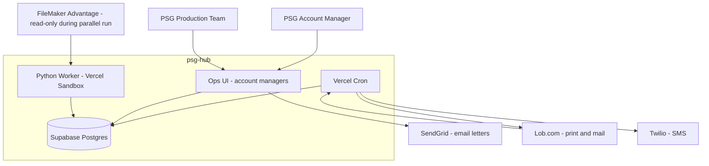
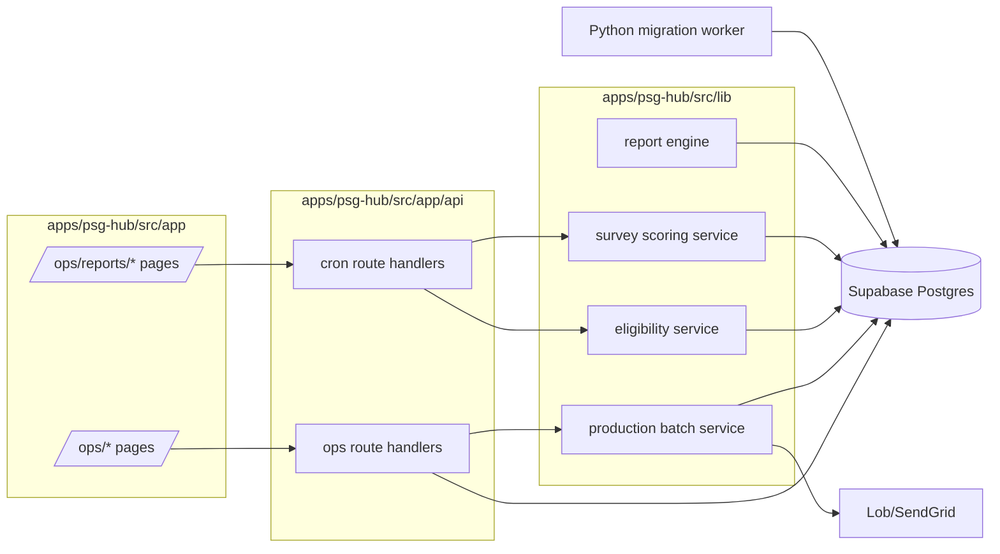
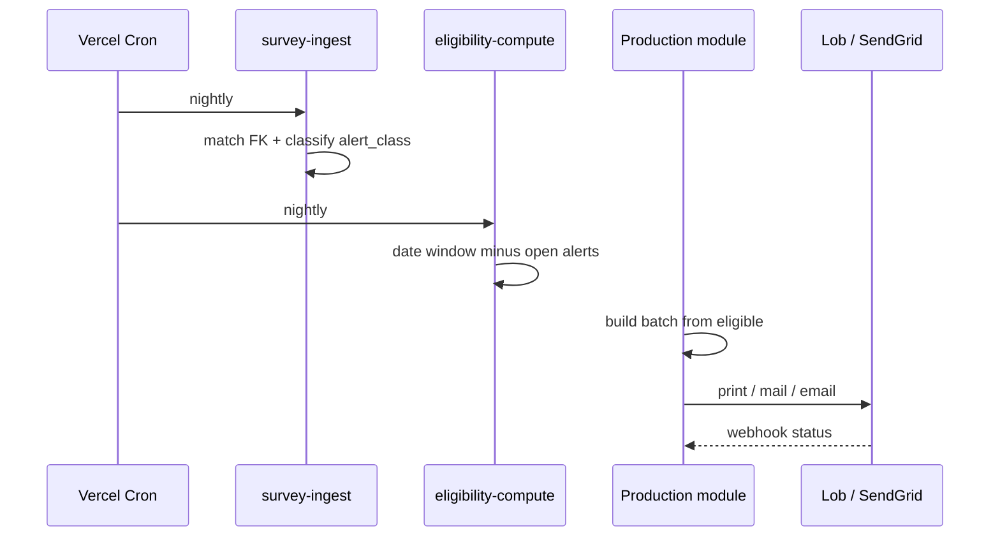

# Solution Design Document

Integrate the legacy FileMaker Advantage Program (the Advantage, Survey, Import Flush, and Web files) into psg-hub as native ops modules, and migrate its historical data. This SDD turns the DDR analysis in `agents/CIO/FileMaker-Analysis-2026-06-08/` into a build spec aligned to the psg-hub milestone plan (`projects/psg-hub/PLANNING.md`).

## Validation Checklist

### CRITICAL GATES (Must Pass)

- [x] All required sections are complete
- [x] No [NEEDS CLARIFICATION] markers remain
- [x] Architecture pattern is clearly stated with rationale
- [ ] **All architecture decisions confirmed by user** (ADRs below are Proposed — pending Nick's confirmation)
- [x] Every interface has specification

### QUALITY CHECKS (Should Pass)

- [x] All context sources are listed with relevance ratings
- [x] Project commands are discovered from actual project files
- [x] Constraints → Strategy → Design → Implementation path is logical
- [x] Every component in diagram has directory mapping
- [x] Error handling covers all error types
- [x] Quality requirements are specific and measurable
- [x] Component names consistent across diagrams
- [x] A developer could implement from this design

---

## Constraints

CON-1 Target stack is fixed by psg-hub: Next.js 16 App Router, React 19.2, TypeScript strict, Supabase Postgres (shared project `gylkkzmcmbdftxieyabw`), Redis, Tailwind 4 + shadcn, Vercel hosting, Vercel Sandbox for Python workers. No new datastore. The four FileMaker files collapse into the single shared Supabase schema.

CON-2 Delivery is sequential on one team. The customer track (v0.1–v0.4) ships first. The ops backbone that replaces FileMaker ships v1.1 → v1.4. FileMaker stays the authoritative daily driver until the v1.3 cutover and stays read-only for history after. Historical data migration is optional add-on scope v1.3.5 (Q15/Q2).

CON-3 PII is load-bearing. Repair customers are end consumers with names, addresses, phones, emails, and survey content. All new tables follow the existing `psg_sensitive_pii_*` redaction patterns, RLS-clamp to authorized shops, and gate ops tables by `security_profiles.functions_jsonb`. OAuth and vendor secrets are encrypted at rest (pgsodium).

CON-4 No FileMaker event-trigger layer exists to preserve. The DDR analysis confirmed 0 layout triggers, 12 object `OnObjectExit` validations, and 1 in-file PSOS. All automation today is the Web file firing Perform Script on Server on a FileMaker Server schedule, plus date-stamp incremental processing. psg-hub must rebuild automation as Vercel cron + Postgres, not port triggers.

CON-5 Behavior must be preserved exactly where it drives revenue or customer contact: letter eligibility windows, the survey alert classifications (Perfect / Misfire / Hot Spot / Unresolved / Referral), the suppression rule (an open survey alert removes a customer from routine mail), and the "printed/posted" idempotency stamps. These are specified from the DDR, not reinvented.

## Implementation Context

**IMPORTANT**: Read and analyze ALL listed context sources before implementing.

### Required Context Sources

#### Documentation Context
```yaml
- doc: agents/CIO/FileMaker-Analysis-2026-06-08/03 - Cross-File Architecture Analysis.md
  relevance: CRITICAL
  why: "Source-of-behavior for the survey→letter feedback loop, match keys, and the four-file topology"

- doc: agents/CIO/FileMaker-Analysis-2026-06-08/01 - Advantage - Business Logic Profile.md
  relevance: CRITICAL
  why: "Letter lifecycle, print/production pipeline, eligibility windows, the report engine"

- doc: agents/CIO/FileMaker-Analysis-2026-06-08/02 - Survey - Business Logic Profile.md
  relevance: CRITICAL
  why: "Survey scoring, the Perfect/Misfire/HotSpot/Unresolved/Referral alert subsystem, post-date stamps"

- doc: agents/CIO/FileMaker-Analysis-2026-06-08/04 - Import Flush - Business Logic Profile.md
  relevance: HIGH
  why: "The 325 per-shop importers that import_templates + psg-import replace"

- doc: agents/CIO/FileMaker-Analysis-2026-06-08/05 - Web - Business Logic Profile.md
  relevance: HIGH
  why: "The cron/scheduler the Vercel cron surface replaces"

- doc: projects/psg-hub/PLANNING.md
  relevance: CRITICAL
  why: "71 design decisions, data model, API surface, and v0.1–v2.0 milestones this SDD plugs into"

- doc: apps/psg-hub/.paul/codebase/{ARCHITECTURE,STACK,INTEGRATIONS,CONCERNS}.md
  relevance: HIGH
  why: "Existing patterns to inherit (Supabase SSR, pg pool, dashboard component pattern, cron gaps)"
```

#### Code Context
```yaml
- file: apps/psg-hub/src/app/api/
  relevance: HIGH
  why: "REST route conventions for the new ops + cron endpoints"

- file: apps/psg-hub/supabase/migrations/
  relevance: CRITICAL
  why: "Where the new schema migrations land; resolve against BSM + advantage-portal schemas"

- file: psg-import/src/
  relevance: HIGH
  why: "RO/Estimate import preprocessor absorbed into v1.1 ops; replaces FileMaker Import Flush"

- file: psg-data-lake/Export/
  relevance: HIGH
  why: "Vendor xlsx (Advantage repair + survey responses) — a migration source alongside the DDR CSVs"

- file: psg-advantage-portal/src/lib/{supabase,postgres}/
  relevance: MEDIUM
  why: "SSR client + pg pool patterns to reuse for heavy report reads"
```

#### External APIs
```yaml
- service: SendGrid
  relevance: HIGH
  why: "Transactional + bulk letter email; replaces Advantage Email Report delivery on psgweb.me"

- service: Lob.com
  relevance: HIGH
  why: "Print-and-mail vendor for physical letters (Production dual adapter, primary path)"

- service: Twilio
  relevance: MEDIUM
  why: "SMS survey reminders + production status (new capability, not in FileMaker)"

- service: FileMaker Data API (psgweb.me host)
  relevance: MEDIUM
  why: "Optional read bridge during parallel run (v1.1–v1.3) and the v1.3.5 migration extract path"
```

### Implementation Boundaries

- **Must Preserve**: letter eligibility windows (3/6/12/18/24 month, birthday, drivers license); survey alert classifications and thresholds; the suppression rule (open alert removes a customer from routine mail); idempotent "printed/posted" semantics; per-shop and per-insurer letter variants; the customer↔survey match relationship.
- **Can Modify**: the composite string match key (replace with a real foreign key); the 325 per-shop import scripts (replace with `import_templates`); the three live alert-script generations (collapse to one); the per-letter triplicate scripts (Preview/Print/Loop) collapse into batch + template + status.
- **Must Not Touch**: the live FileMaker files during parallel run, except read-only extracts. psg-hub writes its own data; no two-way sync back into FileMaker. BSM and advantage-portal shipped schemas are extended, not rebuilt.

### External Interfaces

#### System Context Diagram



#### Interface Specifications

```yaml
inbound:
  - name: "Ops Web UI"
    type: HTTPS
    format: REST (Next.js route handlers)
    authentication: Supabase Auth session + security_profiles function flags
    data_flow: "Account managers manage companies, ROs, estimates, surveys, production batches"

  - name: "Mail vendor webhook (Lob)"
    type: HTTPS
    format: JSON
    authentication: HMAC signature
    data_flow: "Delivery status updates for mailed letters → mail_vendor_jobs"

  - name: "Vercel Cron"
    type: HTTPS (scheduled)
    format: internal
    authentication: cron secret header
    data_flow: "Eligibility compute, survey ingest, batch status poll, alert classification"

outbound:
  - name: "SendGrid"
    type: HTTPS
    format: REST
    authentication: API Key
    data_flow: "Letter and report email"
    criticality: HIGH

  - name: "Lob.com"
    type: HTTPS
    format: REST
    authentication: API Key
    data_flow: "Physical letter print + mail"
    criticality: HIGH

  - name: "Twilio"
    type: HTTPS
    format: REST
    authentication: API Key
    data_flow: "Survey reminder + production status SMS"
    criticality: MEDIUM

  - name: "FileMaker Data API"
    type: HTTPS
    format: REST
    authentication: token (session)
    data_flow: "Read-only extract during parallel run and v1.3.5 migration"
    criticality: MEDIUM

data:
  - name: "Supabase Postgres"
    type: PostgreSQL
    connection: Supabase SSR client + pg pool for heavy report reads
    data_flow: "All ops + survey + production state"

  - name: "Redis"
    type: Redis (ioredis)
    connection: Client library
    data_flow: "Rate limit + report cache"
```

### Cross-Component Boundaries

- **API Contracts**: `/api/ops/*`, `/api/ops/reports/*`, `/api/cron/*` are internal contracts owned by the ops track. The mail vendor webhook is an external contract that cannot break without a Lob dashboard change.
- **Team Ownership**: single delivery team; ops modules owned by the same team that ships customer track. Python migration worker owned jointly with whoever maintains `psg-data-lake`.
- **Shared Resources**: one Supabase project shared with BSM, advantage-portal, ads-dashboard, local_reach. Schema migrations must not collide.
- **Breaking Change Policy**: ops endpoints are internal; version in-path only if a stable external consumer appears. Migrations are forward-only.

### Project Commands

```bash
# Discovered from apps/psg-hub/package.json + workspace root
Install: pnpm install
Dev:     pnpm dev --filter=psg-hub
Test:    pnpm test            # Vitest 4
E2E:     pnpm --filter=psg-hub exec playwright test
Lint:    pnpm lint
Typecheck: pnpm typecheck
Build:   pnpm build           # turbo

# Database (Supabase)
Migrate: supabase migration up   # apply migrations in apps/psg-hub/supabase/migrations/
Seed:    node apps/psg-hub/scripts/seed.mjs   # roles, modules, security_profiles, master data

# Migration worker (Python, Vercel Sandbox / psg-data-lake venv)
Extract+Load: python psg-data-lake/fm_migrate.py --entity repair_customers   # NEW (v1.3.5)
```

## Solution Strategy

- **Architecture Pattern**: Module-per-domain inside the psg-hub Next.js App Router, over the shared Supabase schema, with scheduled work moved to Vercel cron and heavy/batch work to a Python worker in Vercel Sandbox. The FileMaker four-file split disappears; the files become logical modules (Ops, Surveys, Production, Reports) on one database.
- **Integration Approach**: Re-platform behavior, do not port code. Each FileMaker subsystem maps to an already-planned psg-hub module and table set. The DDR analysis supplies the exact rules (eligibility windows, alert thresholds, suppression, idempotency) those modules must encode. Historical data migration is a separate, optional phase (v1.3.5) so functional replacement is not blocked by data movement.
- **Justification**: psg-hub PLANNING.md already commits to replacing FileMaker and already drafts the target tables (`repair_customers`, `survey_responses`, `production_batches`, the 26 reports) and cron surfaces. This SDD fills the one gap PLANNING flagged: the behavioral spec for what those modules must do. Re-platforming on the planned schema is lower risk than a FileMaker-to-SQL lift-and-shift, because the analysis showed the FileMaker design carries heavy duplication (325 import scripts, triplicate letter scripts, three alert generations) that should not be reproduced.
- **Key Decisions**: (1) composite string match key becomes a real foreign key; (2) date-window eligibility finds become SQL + cron; (3) date-stamp idempotency becomes status columns + watermarks; (4) the Web PSOS scheduler becomes Vercel cron; (5) historical migration is ETL through `psg-data-lake`, gated behind v1.3.5.

## Building Block View

### Components



### Directory Map

**Component**: psg-hub ops + surveys + production + reports
```
apps/psg-hub/
├── src/
│   ├── app/
│   │   ├── (ops)/ops/
│   │   │   ├── companies/            # NEW: company/shop ops (v1.1)
│   │   │   ├── repair-customers/     # NEW: end-consumer records (v1.1)
│   │   │   ├── repair-orders/        # NEW: RO entry + import (v1.1)
│   │   │   ├── estimates/            # NEW: estimate entry + import (v1.1)
│   │   │   ├── surveys/              # NEW: survey entry + view (v1.1)
│   │   │   ├── production/           # NEW: batch build + print queue (v1.3)
│   │   │   └── reports/              # NEW: 26 reports (v1.4)
│   │   └── api/
│   │       ├── ops/                  # NEW: ops CRUD + import endpoints
│   │       ├── ops/reports/          # NEW: report query endpoints
│   │       ├── cron/                 # NEW: eligibility, survey-ingest, batch-status
│   │       └── webhooks/lob/         # NEW: mail vendor status
│   ├── lib/
│   │   ├── eligibility/              # NEW: letter eligibility windows + suppression rule
│   │   ├── surveys/scoring/          # NEW: Perfect/Misfire/HotSpot/Unresolved/Referral
│   │   ├── production/               # NEW: batch + print id + idempotency
│   │   ├── reports/                  # NEW: report engine (replaces PDF Generate/Email Report)
│   │   └── filemaker/                # NEW: Data API read client (parallel-run + migration)
│   └── supabase/migrations/         # NEW: ops backbone + surveys + production + reports
```

**Component**: migration worker (v1.3.5)
```
psg-data-lake/
├── fm_migrate.py                     # NEW: orchestrator (extract → transform → load)
├── fm_extract/                       # NEW: DDR CSV + FileMaker Data API readers
├── fm_transform/                     # NEW: match-key resolution, PII redaction, dedupe
└── tests/test_fm_migrate.py          # NEW
```

### Interface Specifications

#### Data Storage Changes

Most target tables already exist in PLANNING.md. This SDD adds the behavioral columns the DDR analysis proved are required, and one cross-cutting addition: the survey↔customer link becomes a real foreign key.

```yaml
Table: survey_responses (EXTEND - planned in PLANNING.md)
  ADD COLUMN: repair_customer_id (fk repair_customers.id, nullable until matched)   # replaces composite string match key
  ADD COLUMN: alert_class (enum: perfect|misfire|hotspot|unresolved|referral|none)  # from DDR classification calcs
  ADD COLUMN: csi_resolve (numeric)                # SQ_Scale_CSI_Resolve
  ADD COLUMN: would_recommend (bool)               # SQ_Would_Recom_Facility
  ADD COLUMN: unresolved_shop (bool)               # SQ_Unresolved_Shop
  ADD COLUMN: referral_consumer (bool)             # SQ_Referral_Consumer
  ADD COLUMN: alert_posted_at (timestamptz, null)  # replaces SQ_Alert_PostDate_* idempotency stamps
  ADD COLUMN: referral_letter_posted_at (timestamptz, null) # replaces S_RC_Referral_Letter_Post
  ADD INDEX: idx_survey_match (repair_customer_id, submitted_at)

Table: repair_customers (EXTEND - planned)
  ADD COLUMN: legacy_match_key (text, indexed)     # RC_MatchField_Master, kept for migration reconciliation only
  ADD COLUMN: referral_tracking_enabled (bool)     # Master Client::M_ReferralNoted_flag (per-company, see company_programs)
  ADD COLUMN: credit_hold (bool)                   # M_CreditHold_flag (suppresses referral path)

Table: letter_eligibility (NEW)
  id: primary_key
  repair_customer_id: fk repair_customers.id
  letter_kind: enum (three_month|six_month|one_year|eighteen_month|two_year|birthday|drivers_license|thank_you|referral)
  eligible: bool
  computed_at: timestamptz
  suppressed_by_alert: bool                        # the survey-alert suppression rule, made explicit
  printed_at: timestamptz, null                    # replaces Letter_*_Printed stamps (idempotency)
  UNIQUE (repair_customer_id, letter_kind, period_key)   # period_key = cycle bucket, prevents double-send

Table: company_programs (EXTEND - planned)
  ADD COLUMN: referral_tracking_enabled (bool)     # drives the Referral vs Misfire branch per shop
  # customizations_jsonb already holds logo/header/footer/greeting (replaces Insert_Letter Header scripts)

# production_batches, production_documents, production_reprint_log, mail_vendor_jobs,
# email_jobs, sms_jobs, import_templates, security_profiles already defined in PLANNING.md — reuse as-is.

schema_doc: projects/psg-hub/PLANNING.md (Data Model)
migration_scripts: apps/psg-hub/supabase/migrations/
```

#### Internal API Changes

```yaml
Endpoint: Compute letter eligibility (cron)
  Method: POST
  Path: /api/cron/eligibility-compute
  Request: { letter_kind?: string }   # all kinds if omitted
  Behavior:
    - Find repair_customers in the date window for each letter_kind (replaces SS - Elgibility - * finds)
    - Apply suppression: WHERE NOT EXISTS open survey alert (alert_posted_at within window)  # the DDR rule
    - Upsert letter_eligibility rows (idempotent on repair_customer_id+letter_kind+period_key)
  Response: { computed: int, eligible: int, suppressed: int }

Endpoint: Ingest + classify surveys (cron)
  Method: POST
  Path: /api/cron/survey-ingest
  Behavior:
    - Pull new survey_responses since watermark
    - Resolve repair_customer_id (FK match; fall back to legacy_match_key during migration)
    - Compute alert_class from csi_resolve + would_recommend + unresolved_shop + referral gates  # DDR calcs
  Response: { ingested: int, classified: {perfect,misfire,hotspot,unresolved,referral,none} }

Endpoint: Build production batch
  Method: POST
  Path: /api/ops/production/batches
  Request: { name: string (unique), product_ids: [], company_ids: []|null }
  Response: { batch_id, document_count }

Endpoint: Mark documents printed (idempotent)
  Method: POST
  Path: /api/ops/production/batches/{id}/print
  Behavior: set production_documents.status=printed, printed_at=now() only where status=unprinted
  Response: { printed: int, skipped_already_printed: int }

Endpoint: Lob status webhook
  Method: POST
  Path: /api/webhooks/lob
  Request: Lob event JSON (HMAC verified)
  Response: 200; updates mail_vendor_jobs.status

Endpoint: Run report
  Method: GET
  Path: /api/ops/reports/{report_slug}
  Behavior: parameter-driven query (replaces PDF Generate Report(ReportName)); 26 slugs from PLANNING.md
  Response: { rows, meta } or rendered PDF/email job id
```

#### Application Data Models

```pseudocode
ENTITY: SurveyResponse (EXTENDED)
  FIELDS:
    repair_customer_id: fk (NEW - real FK replaces composite match key)
    alert_class: enum (NEW)
    csi_resolve, would_recommend, unresolved_shop, referral_consumer (NEW)
    alert_posted_at, referral_letter_posted_at (NEW - idempotency)
  BEHAVIORS:
    classify(): alert_class      # NEW - encodes DDR rules below
    isOpenAlert(asOf): bool      # NEW - drives suppression

ENTITY: LetterEligibility (NEW)
  FIELDS: repair_customer_id, letter_kind, eligible, suppressed_by_alert, printed_at, period_key
  BEHAVIORS:
    compute(window, suppressionRule): void   # replaces SS - Elgibility - * scripts
    markPrinted(): void                       # replaces Loop - * Printed date stamps

ENTITY: ProductionBatch / ProductionDocument (NEW - per PLANNING)
  BEHAVIORS:
    build(productIds, companyIds): documents  # replaces Print - * production scripts
    print(): idempotent status transition     # replaces date-stamp re-send guard
```

#### Integration Points

```yaml
- from: cron/survey-ingest
  to: lib/surveys/scoring
  protocol: in-process
  data_flow: "raw survey rows → alert_class + posted stamps"

- from: cron/eligibility-compute
  to: lib/eligibility
  protocol: in-process
  data_flow: "date windows + open-alert suppression → letter_eligibility"

- from: ops/production
  to: Lob.com / SendGrid
  protocol: REST
  data_flow: "batch documents → printed/mailed/emailed; webhook returns status"

External_Service_FileMaker:
  - integration: "Read-only Data API extract during parallel run + v1.3.5 migration"
  - critical_data: [repair customers, ROs, estimates, survey responses, production history]
```

### Implementation Examples

#### Example: Survey alert classification (the DDR rules, made executable)

**Why this example**: This is the load-bearing logic of the whole customer-experience loop. The thresholds come straight from the Survey file calcs and must match exactly.

```typescript
// Mirrors Survey Input SQ_Alert_*_post calcs (see Survey profile §3).
function classifySurvey(s: SurveyResponse, company: CompanyProgram): AlertClass {
  const happy = s.wouldRecommend && !s.unresolvedShop;
  if (happy && s.referralConsumer && company.referralTrackingEnabled && !s.creditHold) {
    return "referral";              // SQ_Alert_Referral_post
  }
  if (happy && s.csiResolve === 1) return "perfect";   // SQ_Alert_Perfect_post
  if (happy && s.csiResolve < 1)  return "misfire";    // satisfied, would-recommend, not perfect = missed referral
  if (s.unresolvedShop)           return "unresolved";
  if (s.csiResolve < 1)           return "hotspot";
  return "none";
}
```

#### Example: Eligibility suppression rule

**Why this example**: The DDR proved an open survey alert silently removes a customer from routine mail. Make it explicit and queryable, not an emergent side effect.

```sql
-- Replaces Advantage "SS - Elgibility - 3Month" date-window find + IsEmpty(survey alert) guard.
INSERT INTO letter_eligibility (repair_customer_id, letter_kind, eligible, suppressed_by_alert, period_key, computed_at)
SELECT rc.id, 'three_month',
       (sr.id IS NULL),                       -- eligible only if no open alert
       (sr.id IS NOT NULL),                   -- record why suppressed
       date_trunc('month', rc.ro_completed_at),
       now()
FROM repair_customers rc
LEFT JOIN survey_responses sr
  ON sr.repair_customer_id = rc.id
 AND sr.alert_class <> 'none'
 AND sr.alert_posted_at >= now() - interval '120 days'
WHERE rc.ro_completed_at BETWEEN now() - interval '120 days' AND now() - interval '90 days'
ON CONFLICT (repair_customer_id, letter_kind, period_key) DO NOTHING;  -- idempotent, no double-send
```

## Runtime View

### Primary Flow: nightly letter cycle

1. Vercel cron hits `/api/cron/survey-ingest`. New surveys are matched to repair customers by FK and classified into an alert_class; `alert_posted_at` is stamped.
2. Vercel cron hits `/api/cron/eligibility-compute`. For each letter kind, customers in the date window are found, customers with an open alert are suppressed, and `letter_eligibility` rows are upserted idempotently.
3. An account manager (or a scheduled batch) builds a production batch from eligible customers. Documents get a unique print id.
4. Documents are printed via Lob (physical) or emailed via SendGrid, then marked `printed`/`mailed`. Re-running skips already-printed documents.
5. Lob webhook updates delivery status on `mail_vendor_jobs`.



### Error Handling

- Unmatched survey (no repair_customer_id): keep row, leave FK null, surface in a "needs match" ops queue; never silently drop. Replaces the FileMaker risk where a shop-id/month/year mismatch broke the link invisibly.
- Vendor (Lob/SendGrid) failure: mark `mail_vendor_jobs`/`email_jobs` failed with error; cron retries with backoff; document stays `unprinted` so it is not lost.
- Duplicate run / re-trigger: idempotent upserts and `printed_at` guards prevent double-send. This replaces the date-stamp pattern.
- Cron missed (the single-point-of-automation risk from the Web file): each cron is idempotent and window-based, so a missed night self-heals on the next run; add a freshness alert if `computed_at` is stale > 36h.

### Complex Logic: incremental, idempotent processing

```
ALGORITHM: Incremental cycle (replaces FileMaker date-stamp processing)
INPUT: watermark (last run), date window
1. SELECT rows changed/created since watermark
2. RESOLVE foreign keys (repair_customer_id); queue unmatched
3. CLASSIFY / COMPUTE (alert_class or eligibility)
4. UPSERT with unique constraint (idempotent)
5. ADVANCE watermark
6. EMIT counts for observability
```

## Deployment View

### Single Application Deployment
- **Environment**: Vercel (existing psg-advantage-portal project re-linked + renamed psg-hub). Cron via Vercel Cron. Python migration worker via Vercel Sandbox or the `psg-data-lake` venv.
- **Configuration**: `SENDGRID_API_KEY`, `LOB_API_KEY`, `LOB_WEBHOOK_SECRET`, `TWILIO_*`, `CRON_SECRET`, `FILEMAKER_DATA_API_*` (parallel run + migration), existing `SUPABASE_*` + `REDIS_URL`.
- **Dependencies**: Supabase project `gylkkzmcmbdftxieyabw`; SendGrid sender auth on `psgweb.me` (SPF/DKIM/DMARC); Lob account; Twilio number.
- **Performance**: LCP < 3s on `/ops/*` and `/ops/reports/*` (PLANNING quality bar). Heavy reports use the `pg` pool + Redis cache, not PostgREST.

### Multi-Component Coordination
- **Deployment Order**: schema migration → ops endpoints → cron → UI. Production module (v1.3) requires Lob/SendGrid live (v0.1 setup).
- **Feature Flags**: gate `/ops/*` and each cron behind the `modules` registry + `security_profiles` so parallel run can be toggled per function.
- **Rollback Strategy**: forward-only migrations; new tables are additive, so a UI rollback leaves data intact. FileMaker remains authoritative until v1.3 cutover, so rollback = point users back to FileMaker.
- **Data Migration Sequencing (v1.3.5)**: master data → companies/employees → repair_customers → ROs/estimates → survey_responses → production history. Each step reconciles counts against the DDR (281K repair customers, 334K surveys) before the next.

## Cross-Cutting Concepts

### Pattern Documentation
```yaml
- pattern: Supabase SSR client + pg pool (advantage-portal)
  relevance: CRITICAL
  why: "Reuse for ops reads and heavy report queries"
- pattern: Vercel cron + idempotent watermark worker (NEW)
  relevance: CRITICAL
  why: "Replaces the Web PSOS scheduler and FileMaker date-stamp incrementality"
- pattern: import_templates field mapping (NEW, absorbs psg-import)
  relevance: HIGH
  why: "Replaces 325 per-shop FileMaker import scripts with one mapping-driven importer"
```

### System-Wide Patterns
- Security: Supabase Auth + RBAC roles + `security_profiles.functions_jsonb` (`manage_companies`, `manage_surveys`, `manage_production`, `manage_reports`, `manage_data_imports`). RLS clamps customer data to authorized shops.
- Error Handling: never drop unmatched records; queue them. Idempotent writes everywhere a FileMaker date-stamp used to guard.
- Performance: Redis cache for the 26 reports; `pg` pool for heavy reads; cron windows bounded.
- Logging/Auditing: `access_audit` (append-only), `python_worker_jobs`, `email_jobs`/`sms_jobs`/`mail_vendor_jobs` give the audit trail FileMaker lacked.
- PII: `psg_sensitive_pii_*` redaction patterns; survey `raw_payload` redacted; pgsodium for secrets.

### UI (ops)
- Information Architecture: `/ops/{companies,repair-customers,repair-orders,estimates,surveys,production,reports}` behind the ops shell; reuse the advantage-portal dashboard component pattern (page → Dashboard → Panel + Metric + chart).
- Design System: `packages/ui` PSG brand tokens + shadcn; no per-screen styling.
- Interaction: optimistic updates for ops CRUD; explicit confirm + dry-run for production batch print (irreversible mail spend).

## Architecture Decisions

- [ ] ADR-1 Re-platform behavior, do not port FileMaker code or schema 1:1: rebuild on the planned psg-hub schema.
  - Rationale: the DDR showed heavy duplication (325 import scripts, triplicate letter scripts, three alert generations) that should not be reproduced; PLANNING already drafts the target tables.
  - Trade-offs: more upfront design than a lift-and-shift; requires the DDR as the behavioral source of truth.
  - User confirmed: _Pending_

- [ ] ADR-2 Replace the composite string match key with a real foreign key (`survey_responses.repair_customer_id`).
  - Rationale: the FileMaker shop-id+month+year string key broke links silently; a FK plus a "needs match" queue is safer and queryable.
  - Trade-offs: migration must resolve legacy keys to FKs; keep `legacy_match_key` for reconciliation.
  - User confirmed: _Pending_

- [ ] ADR-3 Move all automation to Vercel cron + idempotent Postgres workers; retire the Web PSOS scheduler and date-stamp pattern.
  - Rationale: no FileMaker triggers to preserve; cron + unique constraints give idempotency and self-healing.
  - Trade-offs: a missed cron must self-heal by window design; add freshness alerting.
  - User confirmed: _Pending_

- [ ] ADR-4 Make the survey-alert suppression rule explicit in `letter_eligibility` (`suppressed_by_alert`) rather than an emergent join side effect.
  - Rationale: the suppression was invisible in FileMaker; surfacing it prevents accidental mailing to unhappy customers and is auditable.
  - Trade-offs: one extra column + compute step.
  - User confirmed: _Pending_

- [ ] ADR-5 Historical data migration is optional v1.3.5 via a `psg-data-lake` Python worker, sourced from DDR CSV exports plus the FileMaker Data API; functional replacement (v1.1–v1.4) does not depend on it.
  - Rationale: matches PLANNING Q2/Q15; lets FileMaker stay read-only for history without blocking cutover.
  - Trade-offs: a period where current data is in psg-hub and deep history is in read-only FileMaker.
  - User confirmed: _Pending_

## Quality Requirements

- Performance: `/ops/*` and `/ops/reports/*` LCP < 3s; eligibility + survey-ingest cron each complete < 5 min over full population; report queries cached in Redis.
- Reliability: every cron idempotent; zero double-sends verified by unique constraints; unmatched-survey rate visible and < 2% after migration reconciliation.
- Security: ops tables RLS-gated by security profile flags; customer data clamped to authorized shops; PII redaction parity with existing patterns; manual PII sign-off at v1.1, v1.3, v2.0.
- Migration integrity (v1.3.5): post-load counts reconcile to DDR within tolerance (repair_customers ≈ 281K, survey_responses ≈ 334K); spot-check 50 customer↔survey links resolve correctly.

## Acceptance Criteria

**Surveys + alerts (PLANNING v1.1/v1.4)**
- [ ] WHEN a survey is ingested, THE SYSTEM SHALL resolve its repair_customer_id and set alert_class using the DDR classification rules.
- [ ] IF a survey cannot be matched to a repair customer, THEN THE SYSTEM SHALL retain it and surface it in a needs-match queue.

**Eligibility + suppression (v1.3)**
- [ ] WHEN eligibility is computed, THE SYSTEM SHALL exclude any customer with an open survey alert in the window and record `suppressed_by_alert`.
- [ ] THE SYSTEM SHALL never create a duplicate letter for the same customer, letter_kind, and period.

**Production (v1.3)**
- [ ] WHEN a batch is printed, THE SYSTEM SHALL transition only `unprinted` documents to `printed` and stamp `printed_at`.
- [ ] WHEN Lob returns a status, THE SYSTEM SHALL update the matching `mail_vendor_jobs` row.

**Reports (v1.4)**
- [ ] THE SYSTEM SHALL serve all 26 reports (incl. Perfect Score, Mis-Fire, Hot Spot, Unresolved Issue, Referral Noted) from a parameter-driven engine.

**Migration (v1.3.5, optional)**
- [ ] WHERE the migration add-on is enabled, THE SYSTEM SHALL load historical entities and reconcile counts to the DDR before cutover.

## Risks and Technical Debt

### Known Technical Issues (inherited from FileMaker, per DDR)
- Stale external references in the FileMaker files (BridgeSystem hardcoded path, EmployeeSatisfaction, Import Flush2, dormant PSG_SurveyExport_07.1, broken "Phoenix Solutions Group"). Do not recreate these dependencies; the migration extract must tolerate their absence.
- Three live generations of survey alert scripts (v2/WIP/v3 LIVE). Confirm the v3 LIVE logic is authoritative before encoding `classifySurvey`.
- Import sources include machine-specific local paths. The migration must source from the DDR exports and the Data API, not from a developer workstation.

### Technical Debt to Avoid Reproducing
- The 325 per-shop importers → one `import_templates`-driven importer.
- Triplicate per-letter scripts (Preview/Print/Loop) → batch + template + status.
- Composite string match key → foreign key.

### Implementation Gotchas
- The `referral` vs `misfire` branch depends on per-company `referral_tracking_enabled` and `credit_hold`; both were read cross-file in FileMaker. Seed them onto `company_programs`/`repair_customers` before classification runs, or every survey misclassifies.
- Eligibility windows use RO completion date, not survey date. Keep the two date axes distinct.
- Parallel run (v1.1–v1.3): FileMaker stays authoritative. Do not write back to FileMaker; psg-hub is downstream only until cutover.

## Glossary

### Domain Terms
| Term | Definition | Context |
|------|------------|---------|
| Misfire | A satisfied, would-recommend customer who did not score a perfect CSI; a missed referral | Survey alert class; drives Mis-Fire report + alert |
| Perfect Score | Survey with CSI resolve = 1 and would-recommend | Drives Perfect Score report + referral path |
| Hot Spot | A negative survey result needing follow-up | Survey alert class |
| Suppression | Removing a customer from routine mail because an open survey alert exists | Core feedback-loop rule (ADR-4) |
| Production batch | A set of letters generated for printing/mailing | Replaces FileMaker Print/Production scripts |

### Technical Terms
| Term | Definition | Context |
|------|------------|---------|
| DDR | FileMaker Database Design Report | Source of all behavioral rules in this SDD |
| Idempotent cycle | A run that can repeat without duplicate effects | Replaces FileMaker date-stamp processing |
| Parallel run | Period where FileMaker and psg-hub both operate, FileMaker authoritative | v1.1–v1.3 |
| Cutover | The point psg-hub replaces FileMaker as daily driver | v1.3 |

### API/Interface Terms
| Term | Definition | Context |
|------|------------|---------|
| Report engine | Parameter-driven report runner (`/api/ops/reports/{slug}`) | Replaces PDF Generate Report(ReportName) + Email Report |
| Mail vendor adapter | Lob (physical) + in-house/SendGrid (email) dual path | `mail_vendor_jobs`, `email_jobs` |
| Needs-match queue | Surface for surveys without a resolved repair_customer_id | Error handling for FK resolution |
